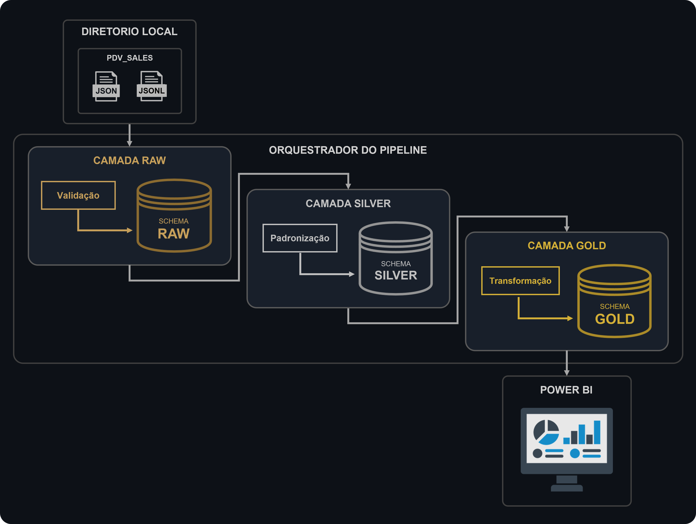
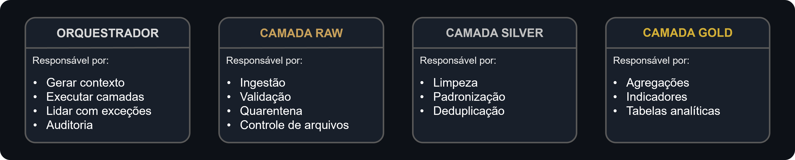

# Data Pipeline

Pipeline de engenharia de dados desenvolvido para simular um ambiente de processamento de eventos de um sistema de PDV.

## Descrição
O projeto implementa uma arquitetura em camadas (Raw, Silver e Gold), realizando ingestão, validação, tratamento, enriquecimento e disponibilização dos dados para análise no Power BI.

## Objetivos

- Simular um pipeline de dados de produção.
- Demonstrar boas práticas de engenharia de dados.
- Implementar arquitetura em camadas.
- Automatizar o processamento de arquivos.
- Disponibilizar dados para análise.

## Fluxo do pipeline (Versão simplificada)


---
## Responsabilidades



## Tecnologias utilizadas

Categoria | Software
-----|-----
Banco de dados | PostgreSQL
Containerização | Docker
Dashboard | Power BI
Transformações | SQL
Versionamento | Git

## Estrutura do projeto

```bash
DATA_PIPELINE/
│
├── docs/
├── images/
│
├── pdv_simulator/
│   ├── config/
│   ├── data/
│   ├── src/
│   └── simulador/
│
├── pipeline/
│   ├── common/
│   ├── config/
│   ├── data_storage/
│   ├── docs/
│   ├── src/
│   └── orquestrador/
│
├── .env.example
├── .gitignore
├── docker-compose.yml
├── README.MD
└── requeriments.txs
```

## Como executar (Finalizar)

### Pré requisitos

Antes de executar o projeto, certifique-se de possuir:

- Windows 11 ou Linux
- WSL2 (recomendado para Windows)
- Docker Desktop 28+
- Git
- Python 3.12+
- PostgreSQL
- Power BI Desktop (opcional, apenas para visualização dos dashboards)

### Guia de instalação (Linux)

```bash
#1. Clone o repositório:
git clone git@github.com:eng-alexis/data_pipeline.git

#2. Acesse a pasta do projeto:
cd data_pipeline

#3. Crie o ambiente virtual
python3 -m venv .venv

#4. Ative o ambiente virtual
source .venv/bin/activate

#5. Instale as dependências
pip install requeriments.txt

#6. Configure o arquivo
cp .env.example .env

#7. Inicie os containers
docker-compose up -d
```
---
### Executando o projeto

#### 1. Gerar arquivos de vendas através do pdv_simulator

```bash
python3 -m pdv_simulator.main
```
#### 2. Executar pipeline
```bash
python3 -m pipeline.orquestrador.pipeline_main
```
#### 3. Abrir dashboard 
```bash
Abrir: link do dashboard
```
## Link para documentações

[Documentação orquestrador](docs/orquestrador.md)

[Documentação camada raw](docs/raw.md)

[Documentação camada silver](docs/silver.md)

[Documentação camada gold](docs/gold.md)

## Versões do projeto

✅ V1

- Pipeline funcionando
- Raw
- Silver
- Gold
- Power BI

## Desenvolvedor

Alexis Pereira dos Santos