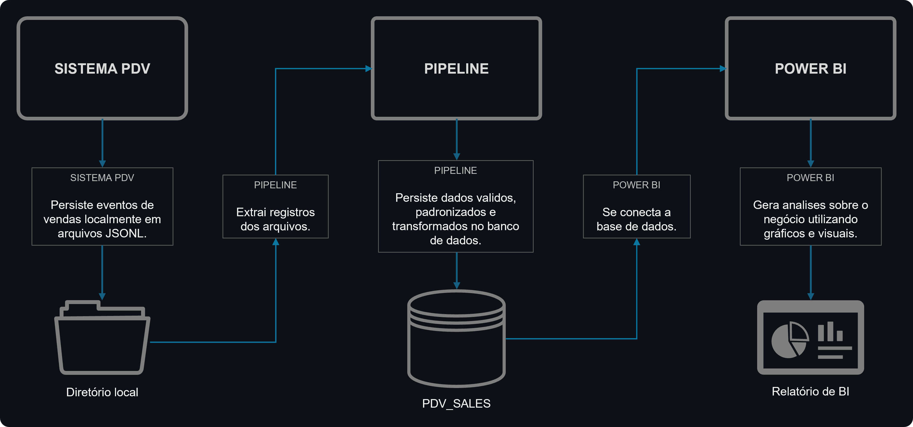
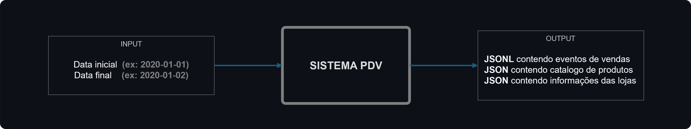
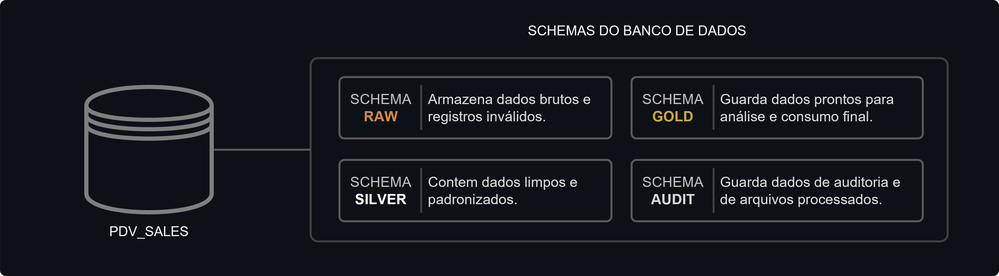
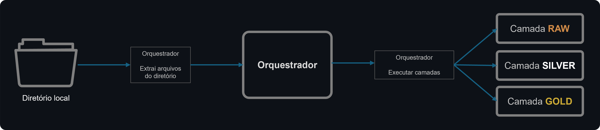

# Data Pipeline

Pipeline de engenharia de dados desenvolvido para simular um ambiente de processamento de eventos gerados por um sistema PDV.

## Contexto e problema de negócio

Uma rede de supermercados utiliza um sistema PDV responsavel por disponibilizar diariamente arquivos contendo eventos de vendas de suas lojas.

[**Clique Aqui**](docs/contexto_projeto.md) para ver o **contexto completo**.

## Objetivo do projeto

- Implementar arquitetura em camadas.
- Disponibilizar dados para análise de negócio.
- Automatizar o processamento de arquivos.

## Fluxo do projeto



## Componentes do projeto

### 1. Sistema PDV

Foi desenvolvido um `simulador` de sistema PDV que tem como objetivo gerar arquivos de vendas com base num intervalo de datas.



[**Clique Aqui**](pdv_simulator/README.md) para ver a **documentação** do pdv_simulator.

### 2. Database

O banco de dados é responsavel por:
- armazenar os registros disponibilizados pelo sistema de PDV.
- armazenar um historico de execuções do pipeline.
- armazenar registros invalidos em quarentena.



[**Clique Aqui**](pipeline/database/README.md) para ver a **documentação** do Database.

### 3. Pipeline

O pipeline implementa uma arquitetura em camadas (Raw, Silver e Gold), realizando:

- Extração e manipulação dos arquivos;
- Validação, padronização e transformação dos dados;
- Disponibilização dos dados para analises de negócio.



[**Clique Aqui**](pipeline/README.md) para ver a **documentação** do Pipeline.

### 4. Relatorio BI

O relatorio de BI busca responder através de graficos e visuais perguntas como:

* total faturamento
* ticket-médio
* horario de pico
* produto mais vendidos

#### Preview:


## Resultados do projeto

O projeto garante:
* O desenvolvimento de um banco de dados para os registros disponibilizados pelo sistema de pdv.
* A persistencia de registros no seu estado original (camada raw)
* Dados padronizados (camada silver)
* Dados transformados e enriquecidos para analises de bi (camada gold)
* Deduplicação barrando arquivos duplicados.
* Define um contrato de dados (verificação de schema)
* Disponibiliza um historico de execuções do pipeline

## Tecnologias utilizadas

|Categoria | Software|
|-----|-----|
|Banco de dados | PostgreSQL|
|Containerização | Docker|
|Dashboard | Power BI|
|Pipeline | Python|
|Versionamento | Git|

## Estrutura do projeto

```bash
DATA_PIPELINE/
│
├── dashboard/
├── docs/
├── images/
│
├── pdv_simulator/
│   ├── config/
│   ├── data/
│   ├── src/
│   ├── simulador/
│   └── README.md
│
├── pdv_sales/
│   ├── pdv_new_files/
│   ├── pipe_processed_files/
│   └── pipe_reject_files/
│
├── pipeline/
│   ├── common/
│   ├── config/
│   ├── database/
│   ├── src/
│   ├── orquestrador/
│   └── README.md
│
├── .env.example
├── .gitignore
├── docker🔲compose.yml
├── README.MD
└── requeriments.txs

#obs: o diretorio pdv_sales/ e seus subdiretórios são criados automaticamente durante a execução do pdv_simulator e do pipeline.
```

## Como executar o projeto.

[**Clique Aqui**](docs/como_executar.md) para ver o **guia de execução** do projeto.

## Links para documentações

[**Documentação**](pdv_simulator/README.md) do pdv_simulator

[**Documentação**](pipeline/database/README.md) do database

[**Documentação**](pipeline/README.md) do pipeline

## Versões do projeto

✅ V1

- Pipeline funcionando
- Raw
- Silver
- Gold
- Power BI

## Desenvolvedor

Alexis Pereira dos Santos