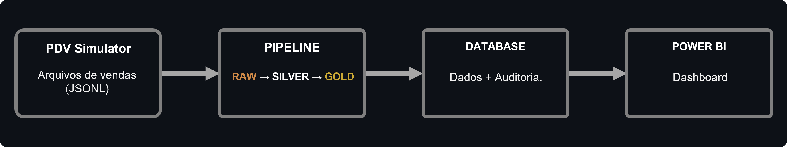
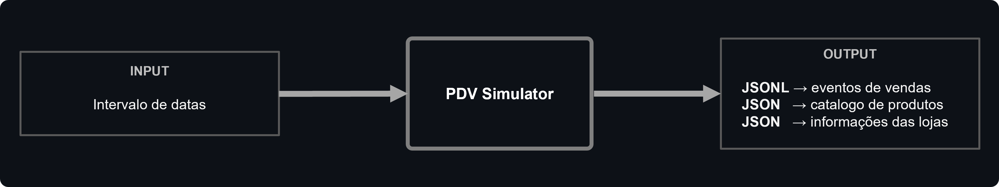
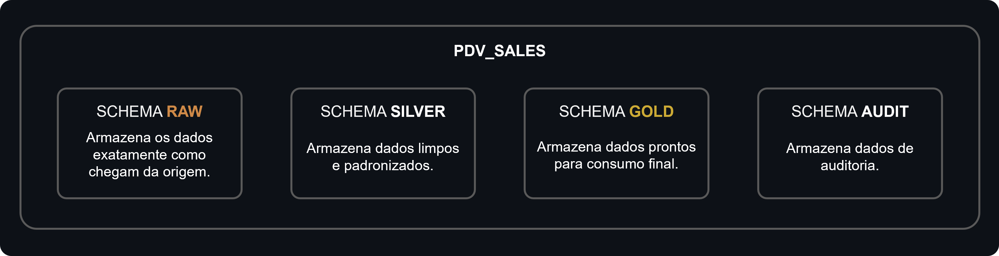
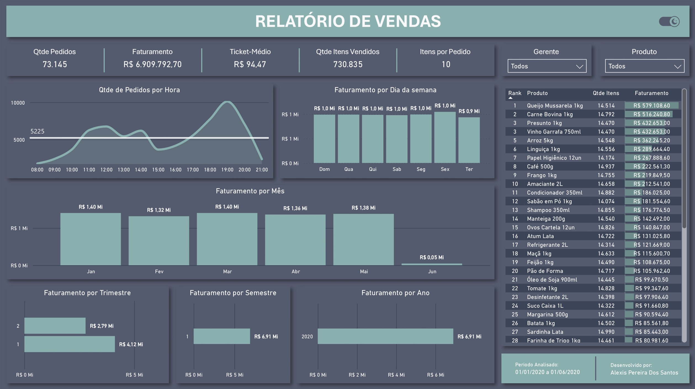

# Data Pipeline

Pipeline de engenharia de dados desenvolvido para simular um ambiente de processamento de eventos gerados por um sistema de PDV (Ponto de Venda).

## Sumário

<details>
  <summary>Clique para expandir o Sumário</summary>
  <ol>
    <li><a href="#contexto-e-problema-de-negocio">Contexto e problema de negócio</a></li>
    <li><a href="#objetivos-do-projeto">Objetivos do projetor</a></li>
    <li><a href="#fluxo-do-projeto">Fluxo do projeto</a></li>
    <li><a href="#componentes-do-projeto">Componentes do projeto</a></li>
    <li><a href="#resultados-do-projeto">Resultados do projeto</a></li>
    <li><a href="#tecnologias-utilizadas">Tecnologias utilizadas</a></li>
    <li><a href="#estrutura-do-projeto">Estrutura do projeto</a></li>
    <li><a href="#como-executar">Como executar</a></li>
    <li><a href="#documentação">Documentação</a></li> 
    <li><a href="#versões-do-projeto">Versões do projeto</a></li> 
    <li><a href="#desenvolvedor">Desenvolvedor</a></li>
  </ol>
</details>

## Contexto e problema de negócio

Uma rede de supermercados utiliza um sistema PDV responsável por disponibilizar diariamente arquivos contendo eventos de vendas de suas lojas.

Para conhecer o cenário de negócio e os requisitos considerados no desenvolvimento do projeto, consulte o [contexto completo do projeto](docs/contexto_projeto.md).

## Objetivos do projeto

- Implementar uma arquitetura de dados em camadas;
- Processar e transformar os dados gerados pelo sistema de PDV;
- Disponibilizar dados preparados para análises de negócio;
- Automatizar o processamento dos arquivos;
- Implementar mecanismos de validação, deduplicação e auditoria do processamento.

## Fluxo do projeto

O fluxo geral do projeto é composto por quatro componentes principais:

- Sistema PDV
- Database
- Pipeline
- Relatório de BI



## Componentes do projeto

### 1. PDV Simulator

Foi desenvolvido um simulador de sistema PDV responsável por gerar arquivos contendo eventos de vendas com base em um intervalo de datas informado pelo usuário.



Consulte a documentação do PDV Simulator para obter mais informações sobre seu funcionamento.

### 2. Database

O banco de dados é responsável por:

- Armazenar os registros disponibilizados pelo sistema de PDV;
- Armazenar o histórico de ciclos e execuções do pipeline;
- Armazenar registros inválidos em tabelas de quarentena;
- Disponibilizar as estruturas necessárias para as camadas RAW, SILVER e GOLD.



Consulte a documentação do Database para obter mais informações sobre sua estrutura e configuração.

### 3. Pipeline

O pipeline implementa uma arquitetura de dados em camadas (RAW, SILVER e GOLD), realizando:

- Extração e processamento dos arquivos;
- Validação dos registros;
- Padronização e transformação dos dados;
- Tratamento de registros inválidos;
- Deduplicação de arquivos;
- Auditoria das execuções;
- Disponibilização dos dados para análises de negócio.


Consulte a documentação do Pipeline para obter mais informações sobre seu funcionamento.

### 4. Relatório de BI

O relatório de BI foi desenvolvido no Power BI para permitir a análise dos dados processados pelo pipeline.

Entre as informações disponibilizadas estão:

- Faturamento total;
- Ticket médio;
- Horários de pico de vendas;
- Produtos mais vendidos;
- Outros indicadores relacionados às vendas.

Preview




Para obter instruções sobre como acessar e visualizar o dashboard, consulte o guia de execução.

## Resultados do projeto

Ao final do processamento, o projeto disponibiliza:

- Banco de dados para armazenamento dos registros gerados pelo sistema de PDV;
- Persistência dos dados em seu estado original na camada RAW;
- Dados validados e padronizados na camada SILVER;
- Dados transformados e enriquecidos para análises de BI na camada GOLD;
- Mecanismo de deduplicação para impedir o processamento de arquivos duplicados;
- Validação de schema como contrato de dados;
- Registro de arquivos inválidos em tabelas de quarentena;
- Histórico de ciclos e execuções do pipeline para fins de auditoria.

## Tecnologias utilizadas

|Categoria | Tecnologia|
|-----|-----|
|Linguagem | Python 3.12+|
|Banco de dados | PostgreSQL|
|Containerização | Docker|
|Dashboard | Power BI|
|Versionamento | Git|

## Estrutura do projeto

```text
DATA_PIPELINE/
│
├── dashboard/
│   └── preview/
│
├── docs/
│
├── images/
│
├── pdv_simulator/
│   ├── config/
│   ├── data/
│   ├── src/
│   ├── simulador/
│   └── README.md
│
├── pdv_sales/
│   ├── pdv_new_files/
│   ├── pipe_processed_files/
│   └── pipe_reject_files/
│
├── pipeline/
│   ├── common/
│   ├── config/
│   ├── database/
│   ├── src/
│   ├── orquestrador/
│   └── README.md
│
├── .env.example
├── .gitignore
├── docker-compose.yml
├── README.md
└── requirements.txt
```
Observação: 
> **Observação:** o diretório pdv_sales e seus subdiretórios são criados automaticamente durante a execução do pdv_simulator e do pipeline.

## Como executar

Consulte o [guia de execução](docs/como_executar.md) para obter as instruções de instalação, configuração e execução do projeto.

## Documentação

- [Contexto](docs/contexto_projeto.md) — contexto e problema de negócio.
- [PDV Simulator](pdv_simulator/README.md) — documentação do simulador responsável pela geração dos arquivos de vendas.
- [Pipeline](pipeline/README.md) — documentação do pipeline de dados e suas etapas.
- [Database](pipeline/database/README.md) — documentação da estrutura e configuração do banco de dados.

## Versões do projeto

V1 — Concluída ✅

- Pipeline funcional;
- Camada RAW;
- Camada SILVER;
- Camada GOLD;
- Dashboard desenvolvido no Power BI;
- Validação de schema;
- Deduplicação de arquivos;
- Auditoria das execuções.

## Desenvolvedor

Alexis Pereira dos Santos | E-mail: alexispereira220@gmail.com